# KN01: Docker Grundlagen

## Screenshots

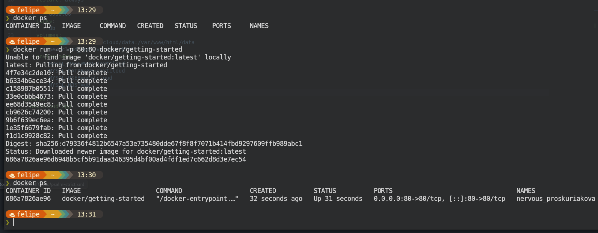
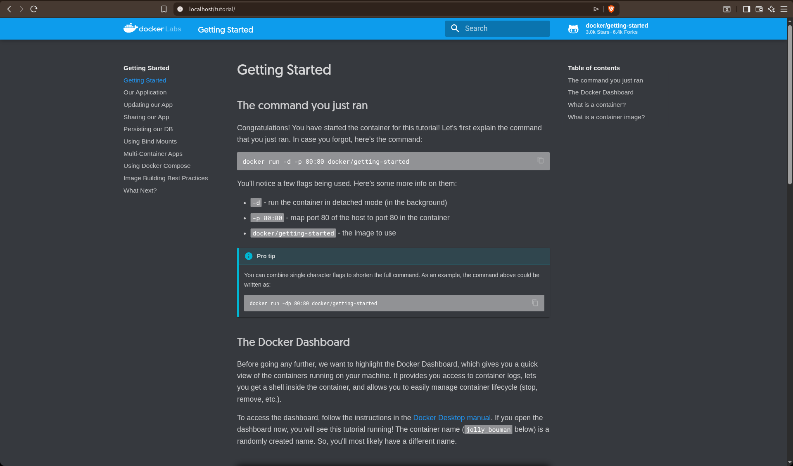
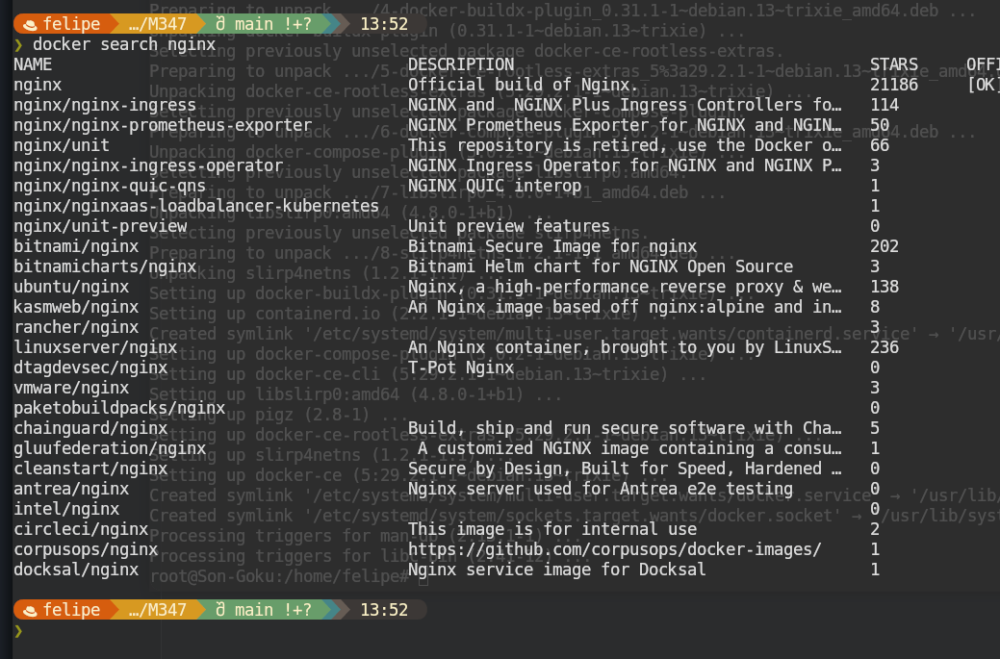
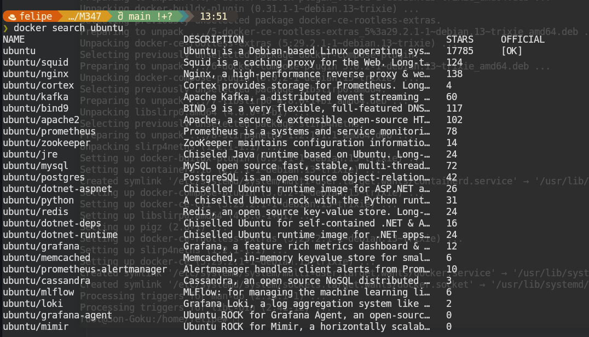

---

## A) Docker CLI

### 1. Docker Version

```bash
docker --version
```

**Output:** `Docker version 29.1.3, build f528148`

---

### 2. Docker Search

```bash
docker search ubuntu
docker search nginx
```

---

### 3. Erklärung `docker run`

```bash
docker run -d -p 80:80 docker/getting-started
```

| Flag                     | Bedeutung                                           |
| ------------------------ | --------------------------------------------------- |
| `-d`                     | detached - Container läuft im Hintergrund           |
| `-p 80:80`               | Port 80 des Hosts auf Port 80 des Containers mappen |
| `docker/getting-started` | Name des zu verwendenden Images                     |

---

### 4. Nginx Container

**Schritte:**

```bash
docker pull nginx                    # Image herunterladen
docker create --name my-nginx -p 8081:80 nginx   # Container erstellen
docker start my-nginx               # Container starten
```

**Screenshots:**

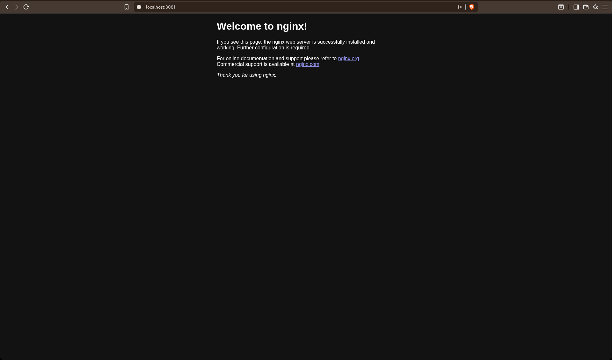 - Nginx läuft
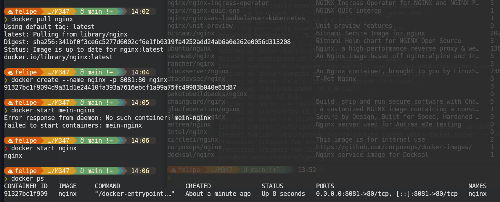 - Browser-Aufruf

---

### 5. Ubuntu Container

#### 5.1 Hintergrund-Modus

```bash
docker run -d ubuntu
```

**Problem:** Ubuntu beendet sich sofort, da kein langlaufender Prozess definiert ist.

#### 5.2 Interaktiver Modus

```bash
docker run -it ubuntu
```

| Flag | Bedeutung                        |
| ---- | -------------------------------- |
| `-i` | interactive - STDIN offen halten |
| `-t` | tty - Pseudo-Terminal allocieren |

---

### 6. Container betreten

```bash
docker exec -it my-nginx /bin/bash
service nginx status
```

---

### 7. Container Status prüfen

```bash
docker ps -a
```

---

### 8-10. Aufräumen

```bash
# Container stoppen und löschen
docker stop my-nginx
docker rm my-nginx
docker rm goofy_haibt

# Images löschen
docker rmi nginx
docker rmi docker/getting-started
```

**Screenshots:**

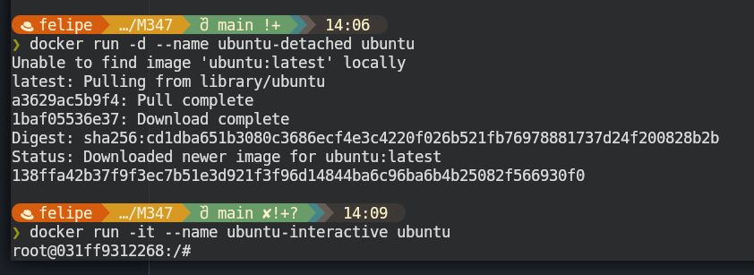
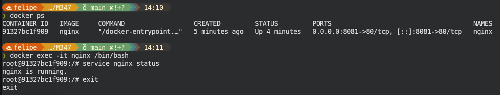
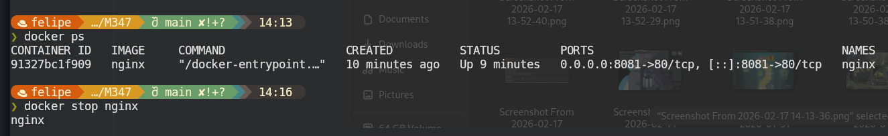
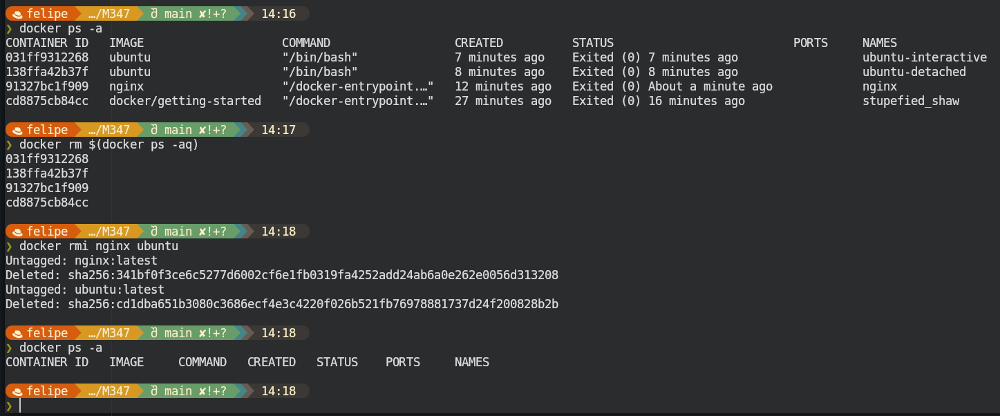

---

## B) Registry und Repository

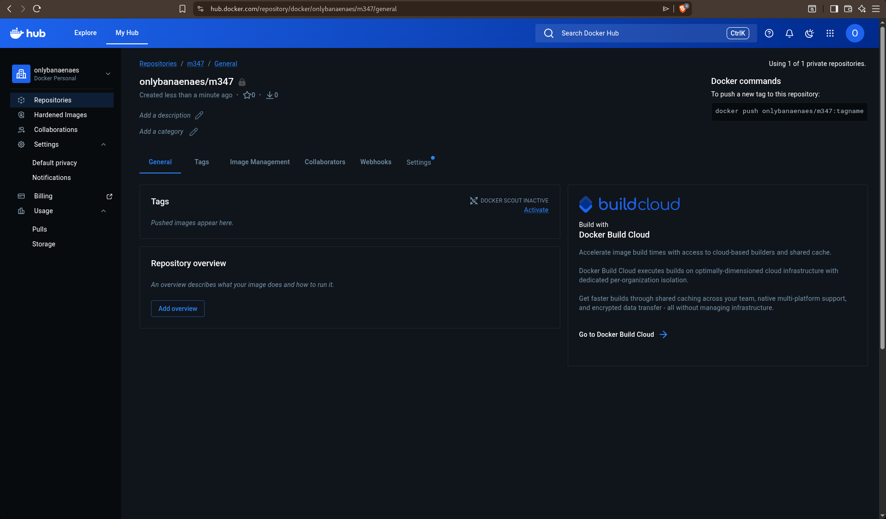

---

## C) Privates Repository

Mein Docker Hub Benutzername: `onlybanaenaes`

### Taggen

```bash
docker tag nginx:latest onlybanaenaes/m347:nginx
```

`docker tag` erstellt einen Alias für ein Image. Der neue Name zeigt auf das eigene Repository.

### Pushenalt text

```bash
docker push onlybanaenaes/m347:nginx
```

`docker push` lädt das Image in das Docker Hub Repository hoch.

### MariaDB

```bash
docker pull mariadb
docker tag mariadb:latest onlybanaenaes/m347:mariadb
docker push onlybanaenaes/m347:mariadb
```

**Screenshots:**

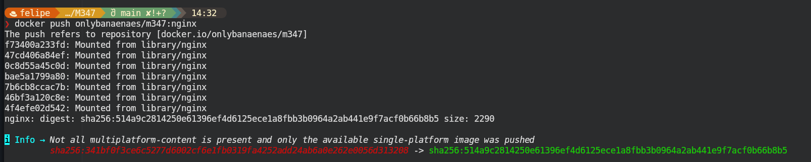
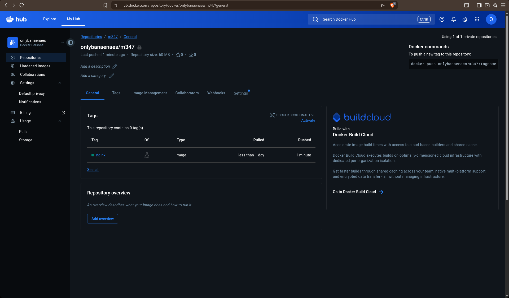

---

## Zusammenfassung

| Befehl          | Funktion                        |
| --------------- | ------------------------------- |
| `docker pull`   | Image herunterladen             |
| `docker run`    | Container erstellen und starten |
| `docker create` | Container erstellen             |
| `docker start`  | Container starten               |
| `docker stop`   | Container stoppen               |
| `docker rm`     | Container löschen               |
| `docker rmi`    | Image löschen                   |
| `docker exec`   | Befehl in Container ausführen   |
| `docker ps`     | Laufende Container anzeigen     |
| `docker tag`    | Image taggen                    |
| `docker push`   | Image in Registry pushen        |
