# KN01

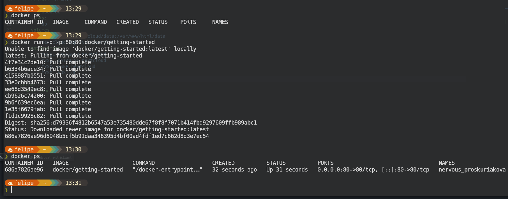
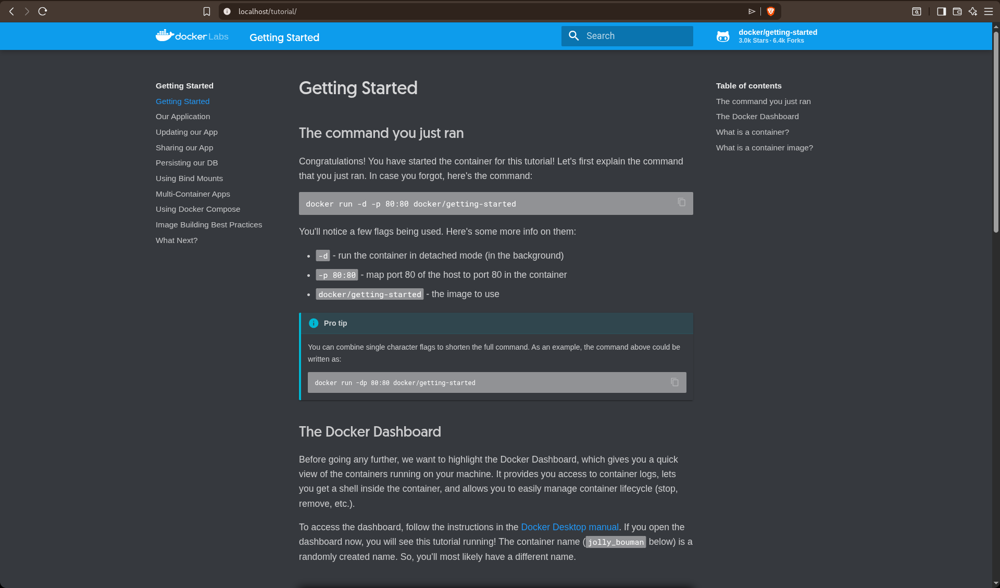
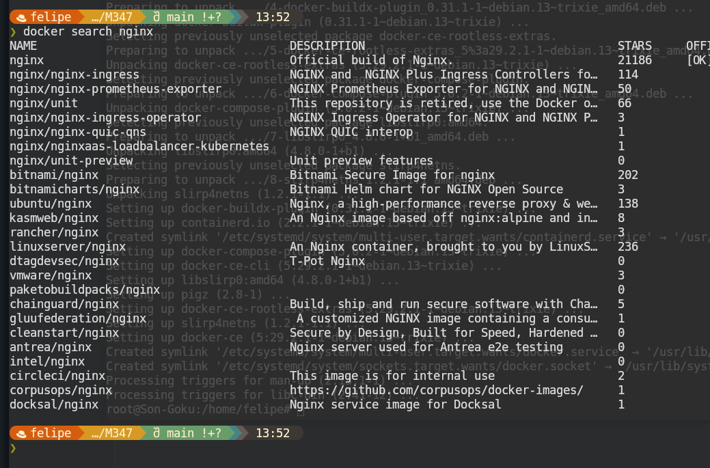
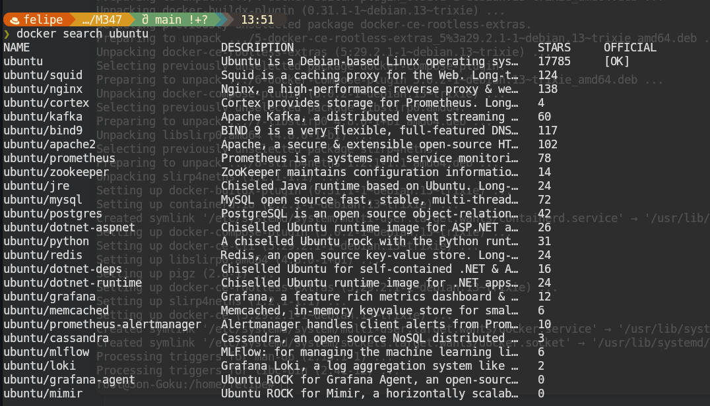

docker run -> einen container pullen, erstellen und starten
-d -> mit daemon starten, so dass nicht der host momentan nicht hosten muss
-p 80:80 -> auf welchem port der server laufen sollte (port 80). der erste port ist für den localhost, auf welchem der server läuft und der zweite ist auf welchem die docker applikation läuft
docker/getting-started -> das docker image das gepulled werden soll. (von docker)

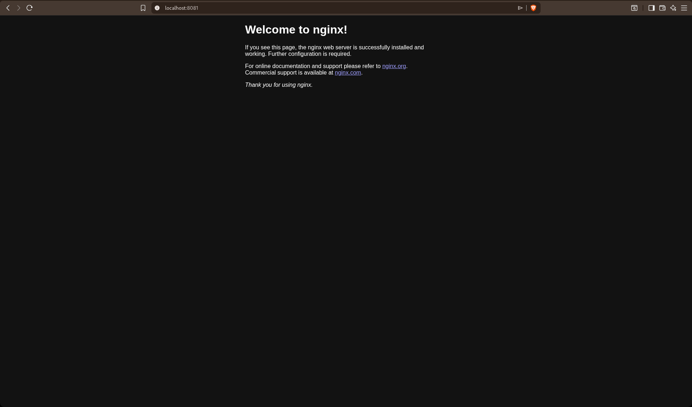
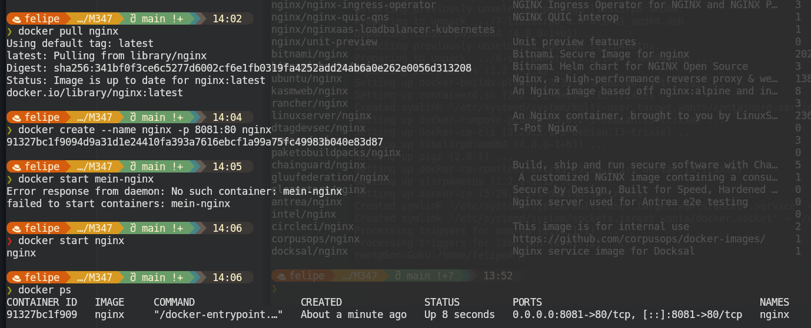
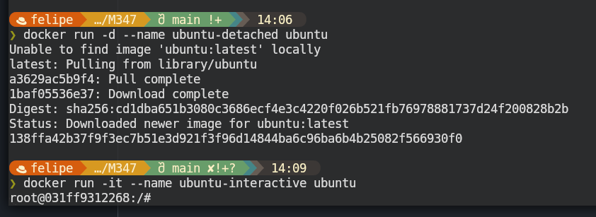
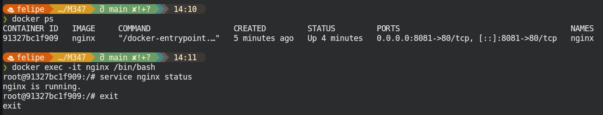
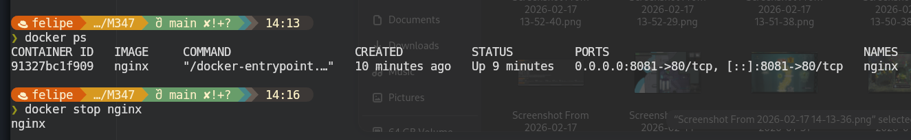
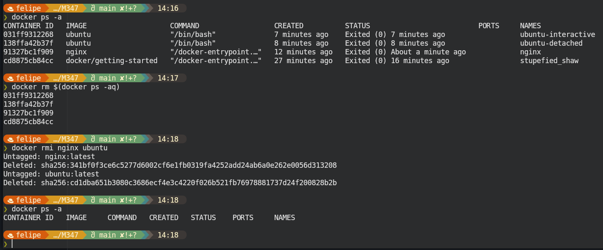
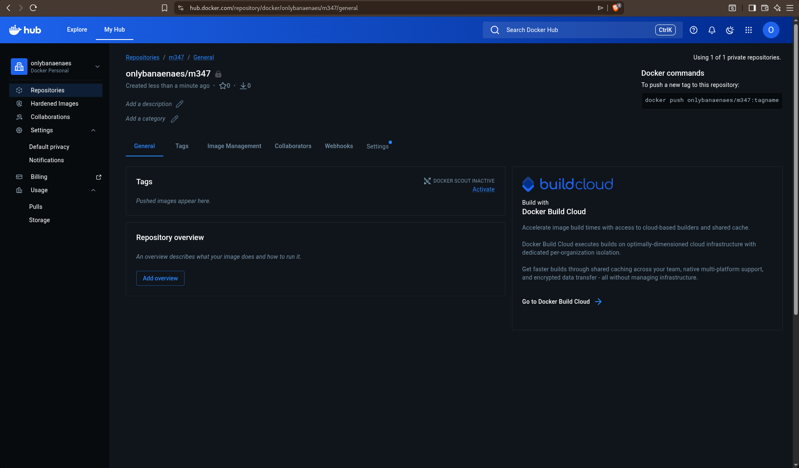
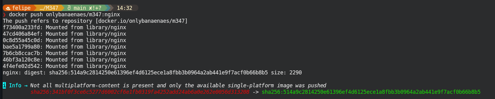
