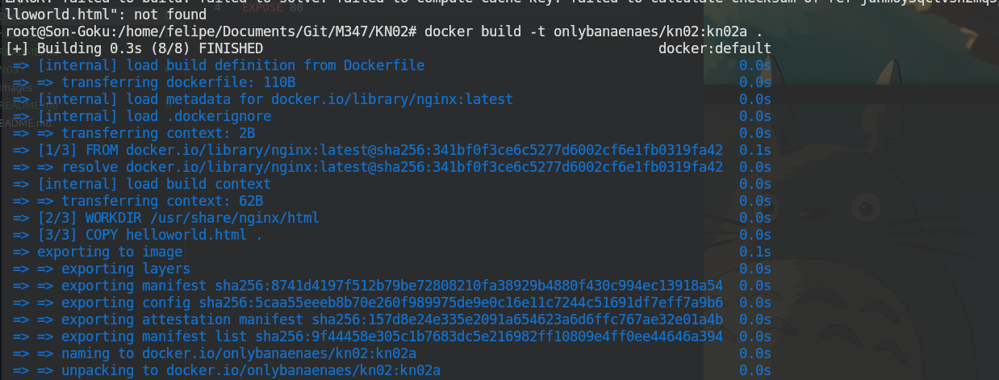
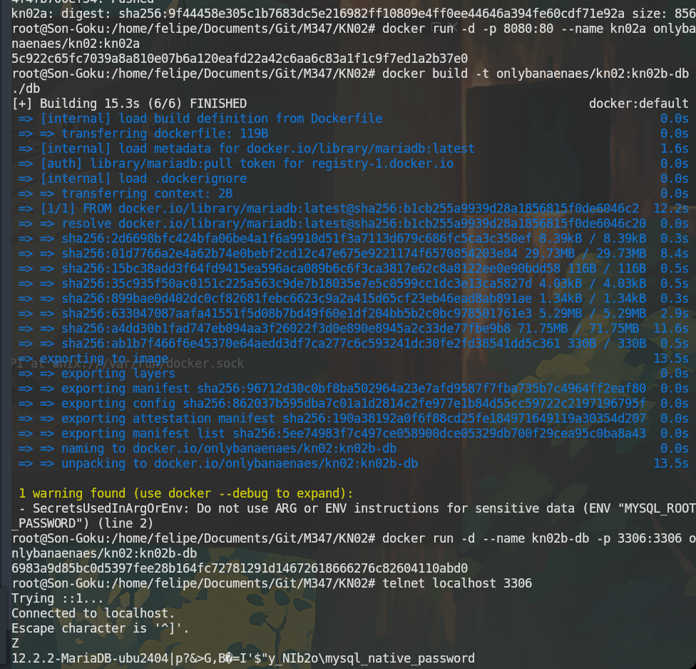
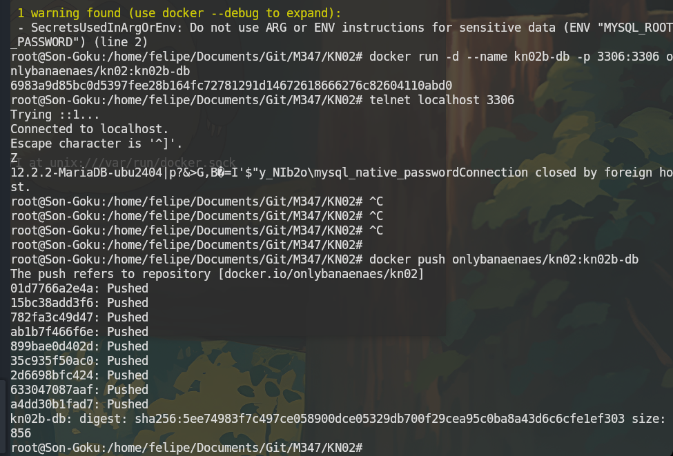
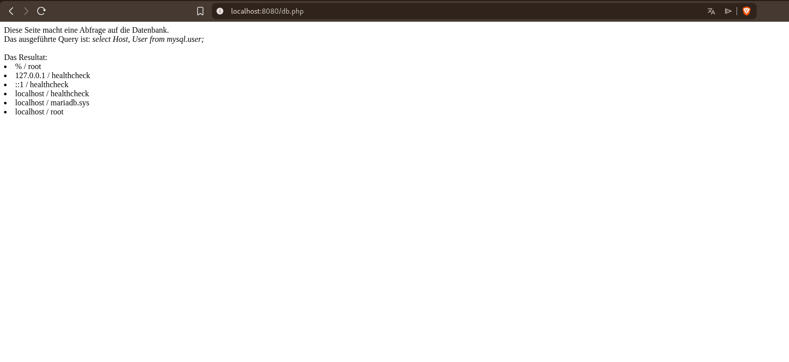

# KN02: Dockerfile

## A) Dockerfile I

### Dokumentiertes Dockerfile

```dockerfile
FROM nginx                          # Basis-Image: nginx wird verwendet
WORKDIR /usr/share/nginx/html       # Arbeitsverzeichnis setzen (hier liegen nginx HTML-Dateien)
COPY helloworld.html .              # HTML-Datei ins Arbeitsverzeichnis kopieren
EXPOSE 80                           # Port 80 nach aussen freigeben
```

### Docker Befehle

```bash
# Image bauen
docker build -t onlybanaenaes/kn02:kn02a .

# Container starten
docker run -d -p 8080:80 --name kn02a onlybanaenaes/kn02:kn02a

# Image pushen
docker push onlybanaenaes/kn02:kn02a
```

### Screenshots




---

## B) Dockerfile II

### DB-Container

#### DB Dockerfile

```dockerfile
FROM mariadb                                # Basis-Image: MariaDB
ENV MYSQL_ROOT_PASSWORD=rootpass            # Root-Passwort setzen
ENV MYSQL_DATABASE=mysql                    # Standard-Datenbank definieren
EXPOSE 3306                                 # MariaDB Port freigeben
```

#### DB Befehle

```bash
# Image bauen
docker build -t onlybanaenaes/kn02:kn02b-db ./db

# Container starten
docker run -d --name kn02b-db -p 3306:3306 onlybanaenaes/kn02:kn02b-db

# Verbindung testen
telnet localhost 3306

# Image pushen
docker push onlybanaenaes/kn02:kn02b-db
```

#### Screenshot Telnet



---

### Web-Container

#### Web Dockerfile

```dockerfile
FROM php:8.0-apache                         # PHP 8.0 mit Apache Webserver
COPY info.php /var/www/html/                # info.php ins Webverzeichnis kopieren
COPY db.php /var/www/html/                  # db.php ins Webverzeichnis kopieren
RUN docker-php-ext-install mysqli           # mysqli PHP-Modul installieren
EXPOSE 80                                   # HTTP Port freigeben
```

#### Angepasste db.php

```php
$servername = "kn02b-db";   // Container-Name als Hostname (via --link)
$username = "root";          // Root-Benutzer
$password = "rootpass";      // Passwort aus DB Dockerfile
$dbname = "mysql";           // Datenbank
```

#### Web Befehle

```bash
# Image bauen
docker build -t onlybanaenaes/kn02:kn02b-web ./web

# Container starten und mit DB verlinken
docker run -d --name kn02b-web -p 8080:80 --link kn02b-db:kn02b-db onlybanaenaes/kn02:kn02b-web

# Image pushen
docker push onlybanaenaes/kn02:kn02b-web
```

#### Screenshots




