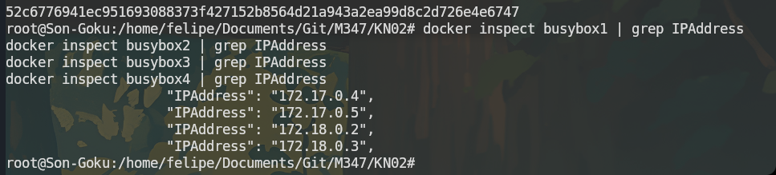
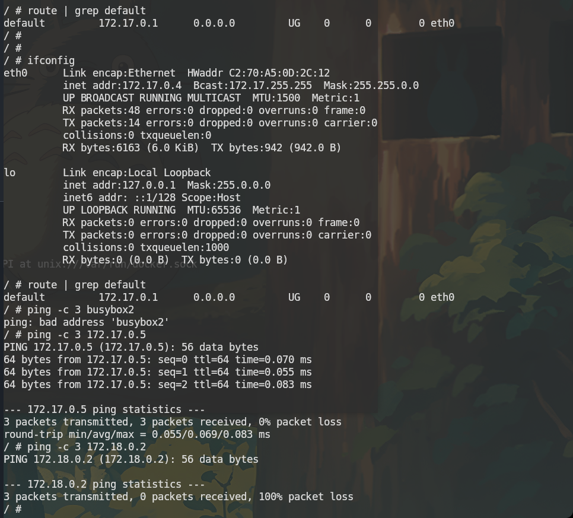
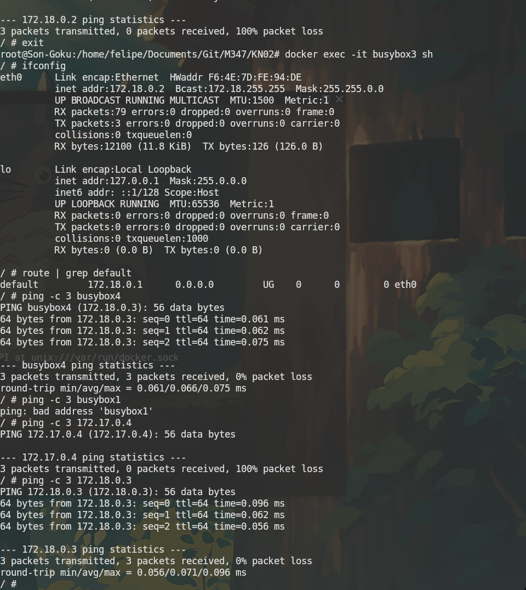

# KN03: Netzwerk

## A) Eigenes Netzwerk

### Befehle

```bash
# Eigenes Netzwerk mit definiertem Subnet erstellen
docker network create --subnet=172.18.0.0/16 tbz

# busybox1 und busybox2 im default bridge Netzwerk starten
docker run -d --name busybox1 busybox sleep 3600
docker run -d --name busybox2 busybox sleep 3600

# busybox3 und busybox4 im tbz Netzwerk starten
docker run -d --name busybox3 --network tbz busybox sleep 3600
docker run -d --name busybox4 --network tbz busybox sleep 3600

# IP-Adressen aller Container anzeigen
docker inspect busybox1 | grep IPAddress
docker inspect busybox2 | grep IPAddress
docker inspect busybox3 | grep IPAddress
docker inspect busybox4 | grep IPAddress
```

### IP-Adressen

| Container | Netzwerk       | IP-Adresse |
| --------- | -------------- | ---------- |
| busybox1  | default bridge | 172.17.0.4 |
| busybox2  | default bridge | 172.17.0.5 |
| busybox3  | tbz            | 172.18.0.2 |
| busybox4  | tbz            | 172.18.0.3 |

### Screenshot IP-Adressen



---

### busybox1 – Interaktive Session

```bash
docker exec -it busybox1 sh
ifconfig
route | grep default
ping -c 3 busybox2       # schlägt fehl – kein DNS im default bridge
ping -c 3 busybox3       # schlägt fehl – kein DNS im default bridge
ping -c 3 172.17.0.5     # funktioniert – gleisches Netzwerk
ping -c 3 172.18.0.2     # schlägt fehl – anderes Netzwerk
exit
```

**Default Gateway von busybox1:** 172.17.0.1 (gleich wie busybox2)

### Screenshot busybox1



---

### busybox3 – Interaktive Session

```bash
docker exec -it busybox3 sh
ifconfig
route | grep default
ping -c 3 busybox4       # funktioniert – DNS im user-defined Netzwerk
ping -c 3 busybox1       # schlägt fehl – kein DNS für anderes Netzwerk
ping -c 3 172.18.0.3     # funktioniert – gleisches Netzwerk
ping -c 3 172.17.0.4     # schlägt fehl – anderes Netzwerk
exit
```

**Default Gateway von busybox3:** 172.18.0.1 (gleich wie busybox4)

### Screenshot busybox3



---

## Gemeinsamkeiten und Unterschiede

**Gemeinsamkeiten:**

- Alle Container können ihren Default-Gateway erreichen
- Container im gleichen Netzwerk können sich per IP erreichen
- Container in verschiedenen Netzwerken können nicht miteinander kommunizieren

**Unterschiede:**

- Im **default bridge** Netzwerk funktioniert kein DNS → Container können sich nicht per Name pingen
- Im **user-defined Netzwerk (tbz)** funktioniert DNS automatisch → `ping busybox4` funktioniert

**Schlussfolgerung:** User-defined Netzwerke sind besser geeignet, weil sie automatisch DNS-Auflösung bieten und die Netzwerke klar voneinander getrennt sind.

---

## Bezug zu KN02

**In welchem Netzwerk befanden sich die beiden Container?**  
Die Container `kn02b-web` und `kn02b-db` befanden sich im **default bridge** Netzwerk.

**Wieso konnten sie miteinander reden?**  
Weil der `--link` Parameter verwendet wurde. Dieser erstellt einen Eintrag in der `/etc/hosts` Datei des Web-Containers, sodass der Name `kn02b-db` auf die IP des DB-Containers aufgelöst werden kann – obwohl DNS im default bridge Netzwerk nicht automatisch funktioniert.
