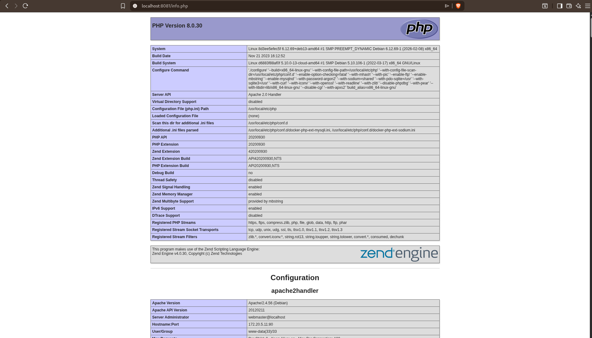
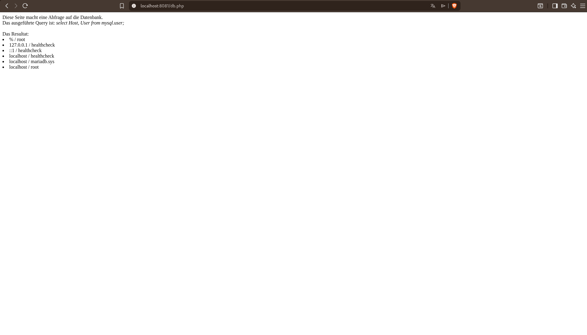
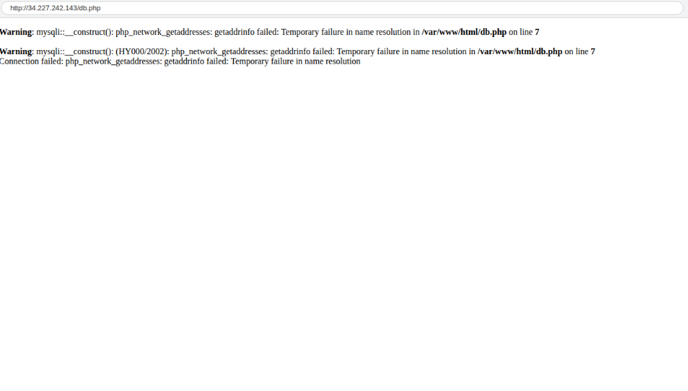
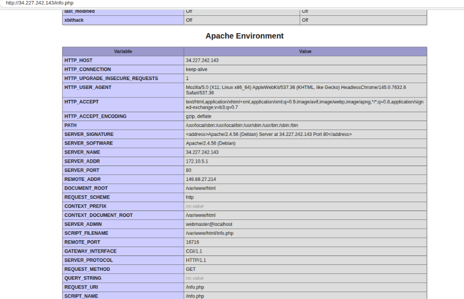

# KN04: Docker Compose

## A) Docker Compose: Lokal

### Teil a) Verwendung von Original Images

#### docker-compose.yml

```yaml
version: "3.8"

services:
  db:
    image: mariadb:latest
    container_name: m347-kn04a-db
    environment:
      MYSQL_ROOT_PASSWORD: rootpass
      MYSQL_DATABASE: mysql
    networks:
      tbznet:
        ipv4_address: 172.10.5.10
    expose:
      - "3306"

  web:
    build: ./web
    container_name: m347-kn04a-web
    ports:
      - "8080:80"
    networks:
      tbznet:
        ipv4_address: 172.10.5.11
    depends_on:
      - db
    links:
      - db:m347-kn04a-db

networks:
  tbznet:
    driver: bridge
    ipam:
      config:
        - subnet: 172.10.0.0/16
          ip_range: 172.10.5.0/24
          gateway: 172.10.5.254
```

#### Dockerfile für Webserver

```dockerfile
FROM php:8.0-apache
COPY info.php /var/www/html/
COPY db.php /var/www/html/
RUN docker-php-ext-install mysqli
EXPOSE 80
```

#### Befehle für docker compose up

`docker compose up` ist eine Zusammenfassung für folgende Befehle:

| Befehl                   | Erklärung                             |
| ------------------------ | ------------------------------------- |
| `docker network create`  | Erstellt das Netzwerk (tbznet)        |
| `docker build`           | Baut das Web-Image aus dem Dockerfile |
| `docker pull`            | Pullt das mariadb Image               |
| `docker create`          | Erstellt Container aus Images         |
| `docker network connect` | Verbindet Container mit Netzwerk      |
| `docker start`           | Startet die Container                 |

---

### Teil b) Verwendung Ihrer eigenen Images

#### docker-compose-own.yml

```yaml
version: "3.8"

services:
  db:
    image: onlybanaenaes/kn02:kn02b-db
    container_name: kn02b-db
    networks:
      tbznet:
        ipv4_address: 172.20.5.10
    expose:
      - "3306"

  web:
    image: onlybanaenaes/kn02:kn02b-web
    container_name: kn02b-web
    ports:
      - "8081:80"
    networks:
      tbznet:
        ipv4_address: 172.20.5.11
    depends_on:
      - db
    links:
      - db:kn02b-db

networks:
  tbznet:
    driver: bridge
    ipam:
      config:
        - subnet: 172.20.0.0/16
          ip_range: 172.20.5.0/24
          gateway: 172.20.5.254
```

#### Erklärung des Fehlers

**Fehler:** "Connection failed: php_network_getaddresses: getaddrinfo failed: Name or service not known"

**Ursache:**

- In der `db.php` aus KN02 ist der Hostname fest auf `"kn02b-db"` eingecodet
- Wenn der Container anders heisst (z.B. `m347-kn04a-db`), kann die Datenbank nicht gefunden werden
- Auch wenn Docker Compose den Container umbenennt, stimmt der hostname in der PHP-Datei nicht mehr

**Lösung:**

- Die `db.php` muss den korrekten Container-Namen verwenden
- Oder: Environment-Variablen verwenden `$servername = getenv('DB_HOST') ?: 'localhost';`
- Oder: Das Netzwerk und die Hostnamen in docker-compose.yml korrekt konfigurieren

#### Screenshots




---

## B) Docker Compose: Cloud

### cloud-init.yml

```yaml
#cloud-config
package_update: true
packages:
  - docker.io
  - docker-compose

write_files:
  - path: /home/ubuntu/docker-compose.yml
    content: |
      services:
        db:
          image: mariadb:latest
          container_name: m347-kn04a-db
          environment:
            MYSQL_ROOT_PASSWORD: rootpass
            MYSQL_DATABASE: mysql
          networks:
            tbznet:
              ipv4_address: 172.10.5.10
          expose:
            - "3306"
        
        web:
          build: ./web
          container_name: m347-kn04a-web
          ports:
            - "80:80"
          networks:
            tbznet:
              ipv4_address: 172.10.5.11
          depends_on:
            - db
          links:
            - db:m347-kn04a-db

      networks:
        tbznet:
          driver: bridge
          ipam:
            config:
              - subnet: 172.10.0.0/16
                ip_range: 172.10.5.0/24
                gateway: 172.10.5.254
    owner: root:root
    permissions: "0644"

  - path: /home/ubuntu/web/Dockerfile
    content: |
      FROM php:8.0-apache
      COPY info.php /var/www/html/
      COPY db.php /var/www/html/
      RUN docker-php-ext-install mysqli
      EXPOSE 80
    owner: root:root
    permissions: "0644"

  - path: /home/ubuntu/web/info.php
    content: |
      <?php
      phpinfo();
      ?>
    owner: root:root
    permissions: "0644"

  - path: /home/ubuntu/web/db.php
    content: |
      <html>
      <head></head>
      <body>
      Diese Seite macht eine Abfrage auf die Datenbank. <br />
      Das ausgeführte Query ist: <i>select Host, User from mysql.user;</i><br /><br />
      Das Resultat: <br />
      <?php
        $servername = "m347-kn04a-db";
        $username = "root";
        $password = "rootpass";
        $dbname = "mysql";

        $conn = new mysqli($servername, $username, $password, $dbname);
        if ($conn->connect_error) {
          die("Connection failed: " . $conn->connect_error);
        }

        $sql = "select Host, User from mysql.user;";
        $result = $conn->query($sql);
        while($row = $result->fetch_assoc()){
          echo("<li>" . $row["Host"] . " / " . $row["User"] . "</li>");
        }
      ?>
      </body>
      </html>
    owner: root:root
    permissions: "0644"

ssh_authorized_keys:
  - ssh-rsa YOUR_PUBLIC_KEY Felipe@Felipe
  - ssh-rsa TEACHER_PUBLIC_KEY lehrer@tbz

runcmd:
  - systemctl start docker
  - systemctl enable docker
  - cd /home/ubuntu && docker compose up -d --build
  - sleep 30

final_message: "Cloud-Init abgeschlossen. System ist bereit."
```

### Screenshots



