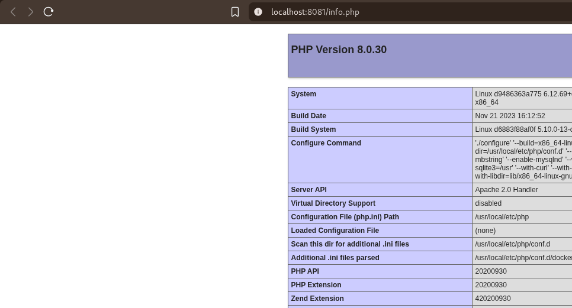
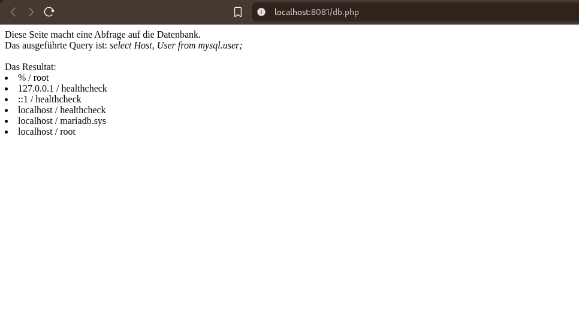
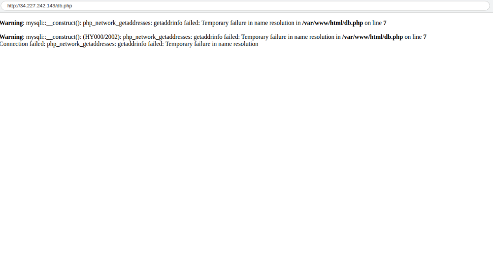
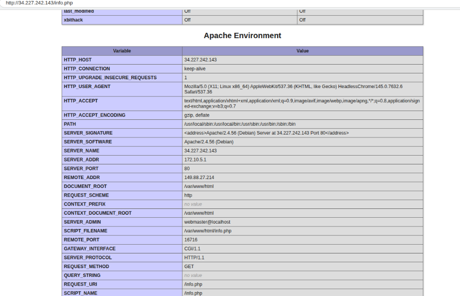
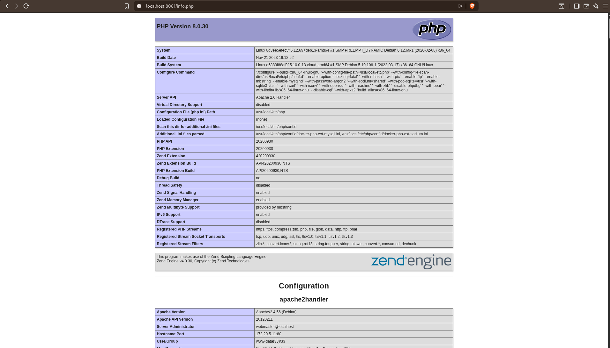
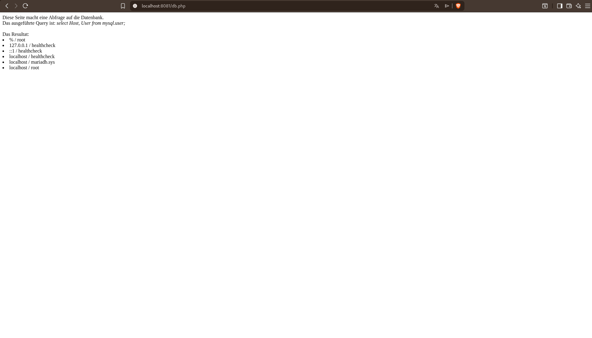

# KN04: Docker Compose

## Screenshots




---

## A) Docker Compose: Lokal

### Teil a) Original Images

#### docker-compose.yml

Siehe [docker-compose.yml](./docker-compose.yml)

#### Dockerfile für Webserver

```dockerfile
FROM php:8.0-apache
COPY info.php /var/www/html/
COPY db.php /var/www/html/
RUN docker-php-ext-install mysqli
EXPOSE 80
```

Siehe auch [web/Dockerfile](./web/Dockerfile)

#### docker compose up Erklärung

`docker compose up` führt automatisch folgende Befehle aus:

| Befehl | Erklärung |
|--------|-----------|
| `docker network create` | Erstellt das Netzwerk (tbznet) |
| `docker build` | Baut das Web-Image aus dem Dockerfile |
| `docker pull` | Pullt das mariadb Image |
| `docker create` | Erstellt Container aus Images |
| `docker network connect` | Verbindet Container mit Netzwerk |
| `docker start` | Startet die Container |

#### Screenshots




---

### Teil b) Eigene Images (aus KN02)

#### docker-compose-own.yml

Siehe [docker-compose-own.yml](./docker-compose-own.yml)

#### Fehlerbehebung

**Fehler:**
```
php_network_getaddresses: getaddrinfo failed: Name or service not known
```

**Ursache:**

Die `db.php` aus KN02 verwendet den Hostname `kn02b-db`. In der ursprünglichen `docker-compose-own.yml` wurde der Link falsch konfiguriert:

```yaml
# Falsch:
links:
  - db:m347-kn04a-db

# Richtig:
links:
  - db:kn02b-db
```

**Lösung:**

Der `links`-Alias muss dem Hostname in der `db.php` entsprechen. Dadurch wird der DB-Container unter dem Namen `kn02b-db` erreichbar.

#### Screenshots




---

## B) Docker Compose: Cloud

### Cloud-Init Konfiguration

Siehe [cloud-init.yaml](./cloud-init.yaml)

#### Wichtige Konfigurationen

- **Docker Installation:** Via `package_update` und `packages` (docker.io, docker-compose)
- **Docker Compose Files:** Via `write_files` in `/home/ubuntu/`
- **SSH Keys:** Via `ssh_authorized_keys` (eigener Key + Lehrperson-Key)
- **Start:** Via `runcmd` mit `docker compose up -d`

#### Screenshots


---

## Zusammenfassung

| Begriff | Erklärung |
|---------|----------|
| `docker compose up` | Startet alle Services aus der YAML-Datei |
| `links` | Verknüpft Container und ermöglicht DNS-Auflösung |
| `networks` | Eigenes Netzwerk für Container-Kommunikation |
| `cloud-init` | Automatische Konfiguration bei VM-Erstellung |