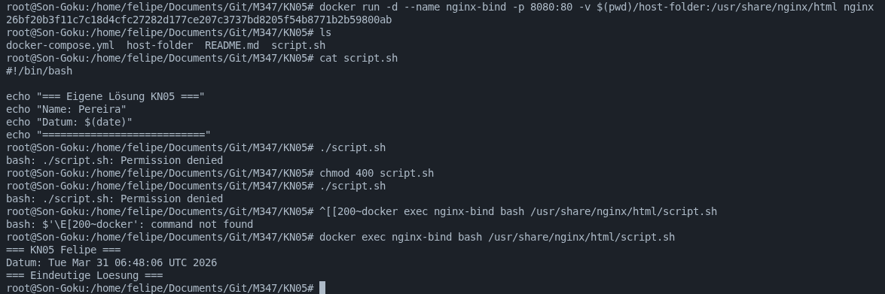
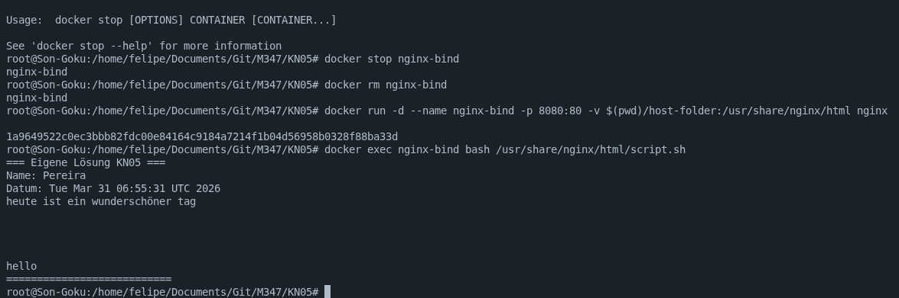
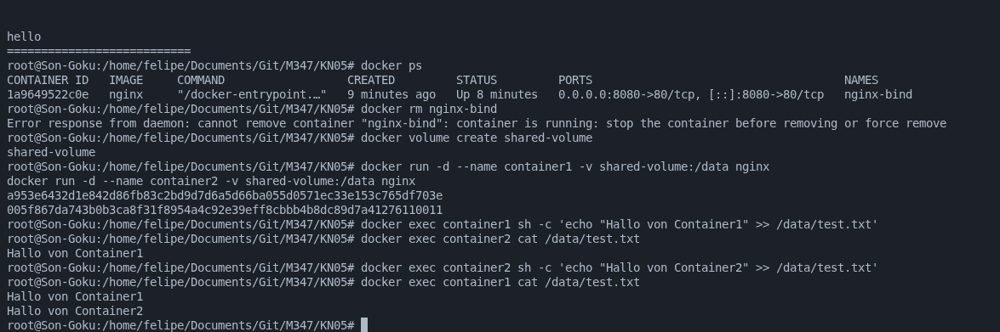
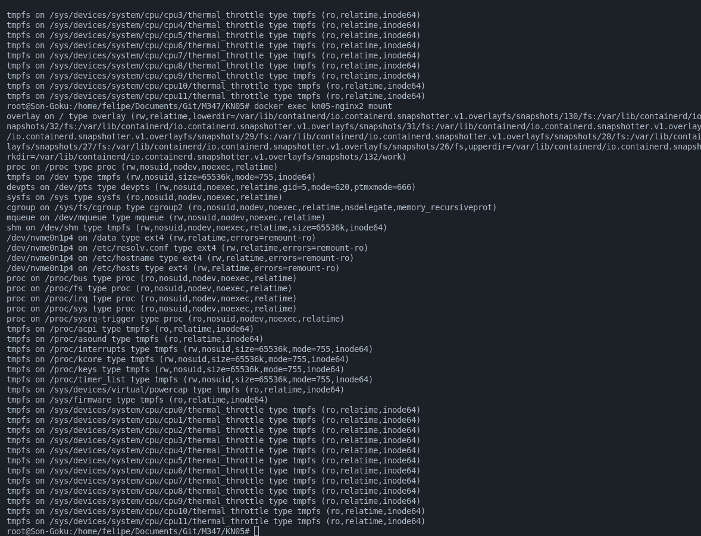

# KN05: Arbeit mit Speicher

## Übersicht

| Teil | Aufgabe        | Abgabe                             |
| ---- | -------------- | ---------------------------------- |
| A    | Bind Mounts    | Befehlsliste + Screencast          |
| B    | Volumes        | Befehlsliste + Screencast          |
| C    | Docker Compose | mount-Ausgabe + docker-compose.yml |

---

## A) Bind Mounts (40%)




### Ziel

Speicher vom Host mit dem Container teilen. Änderungen auf Host sollen sofort im Container sichtbar sein.

### Durchführung

1. **Container mit Bind Mount erstellen:**

   ```bash
   docker run -d --name nginx-bind -p 8080:80 -v /home/felipe/Documents/Git/M347/KN05/host-folder:/usr/share/nginx/html nginx
   ```

   Oder unter Linux/Mac:

   ```bash
   docker run -d --name nginx-bind -p 8080:80 -v $(pwd)/host-folder:/usr/share/nginx/html nginx
   ```

2. **Bash-Skript auf Host erstellen** (einzigartig - eigene Lösung):

   ```bash
   #!/bin/bash
   echo "Eigene eindeutige Ausgabe - [Dein Name]"
   date
   ```

3. **Skript im Container ausführen:**

   ```bash
   docker exec nginx-bind bash /usr/share/nginx/html/script.sh
   ```

4. **Skript auf Host ändern und erneut ausführen** - Änderungen sind sofort sichtbar.

### Abgabe

- [ ] Befehlsliste dokumentieren
- [ ] Screencast erstellen (vorher testen!)

---

## B) Volumes (30%)




### Ziel

Zwei Container verwenden dasselbe Named Volume.

### Durchführung

1. **Named Volume erstellen:**

   ```bash
   docker volume create shared-volume
   ```

2. **Zwei Container mit gleichem Volume starten:**

   ```bash
   docker run -d --name container1 -v shared-volume:/data nginx
   docker run -d --name container2 -v shared-volume:/data nginx
   ```

3. **In Datei schreiben und lesen:**

   ```bash
   # Container 1: Schreiben
   docker exec container1 sh -c 'echo "Von Container1" >> /data/test.txt'

   # Container 2: Lesen
   docker exec container2 cat /data/test.txt

   # Container 2: Schreiben
   docker exec container2 sh -c 'echo "Von Container2" >> /data/test.txt'

   # Container 1: Lesen
   docker exec container1 cat /data/test.txt
   ```

### Abgabe

- [ ] Befehlsliste dokumentieren
- [ ] Screencast erstellen (vorher testen!)

---

## C) Speicher mit Docker Compose (30%)

### Ziel

Alle drei Speichertypen in docker-compose verwenden.

### docker-compose.yml

```yaml
version: "3.8"

services:
  nginx1:
    image: nginx
    volumes:
      # Named Volume - Long Syntax
      - type: volume
        source: my-named-volume
        target: /data
      # Bind Mount
      - type: bind
        source: ./bind-folder
        target: /bind-mount
      # tmpfs
      - type: tmpfs
        target: /tmpfs
    ports:
      - "8081:80"

  nginx2:
    image: nginx
    # Named Volume - Short Syntax
    volumes:
      - my-named-volume:/data
    ports:
      - "8082:80"

volumes:
  my-named-volume:
```

### Durchführung

1. **docker-compose.yml erstellen** (siehe oben)
2. **Container starten:**
   ```bash
   docker compose up -d
   ```
3. **mount Ausgabe abrufen:**
   ```bash
   docker exec kn05-nginx1-1 mount
   docker exec kn05-nginx2-1 mount
   ```

### Abgabe

- [ ] mount Ausgabe von nginx1 (alle 3 Speichertypen)
- [ ] mount Ausgabe von nginx2 (Named Volume)
- [ ] docker-compose.yml

---

## Abgabehinweise

1. **Befehle dokumentieren:** Alle verwendeten Befehle in dieses README oder separate Datei schreiben
2. **Screencast:** Mit Bildschirmaufnahme-Tool aufnehmen (Praxistipps.de Link beachten)
3. **Testen:** Vor dem Aufnehmen alles selbst testen!
4. **Einreichung:** Gemäss den allgemeinen Abgabe-Informationen

---

## Komplette Checkliste für die Abgabe

### Teil A: Bind Mounts

- [ ] Container mit Bind Mount starten (Befehl ins README)
- [ ] script.sh in host-folder/ anpassen (eigene Lösung)
- [ ] Im Container ausführen
- [ ] Skript ändern, erneut ausführen
- [ ] **Screencast aufnehmen**
- [ ] Befehlsliste ins README dokumentieren

### Teil B: Volumes

- [ ] Named Volume erstellen
- [ ] 2 Container starten
- [ ] Gegenseitig schreiben/lesen
- [ ] **Screencast aufnehmen**
- [ ] Befehlsliste ins README dokumentieren

### Teil C: Docker Compose

- [ ] docker compose up -d
- [ ] `docker exec kn05-nginx1 mount` ausführen → ins README
- [ ] `docker exec kn05-nginx2 mount` ausführen → ins README
- [ ] docker-compose.yml abgeben (bereit vorhanden)

---

## Dateien in diesem Ordner

- `script.sh` - Eigenes Bash-Skript für Teil A
- `host-folder/` - Verzeichnis für Bind-Mount Teil A (script.sh hier rein!)
- `docker-compose.yml` - Docker Compose für Teil C
- `bind-folder/` - Bind-Mount-Verzeichnis für Teil C

<!-- Hier eigene Notizen und Befehle hinzufügen -->

### A) Bind Mounts - Eigene Befehle

### B) Volumes - Eigene Befehle

### C) Docker Compose - Eigene Befehle
