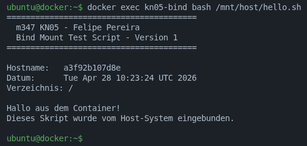
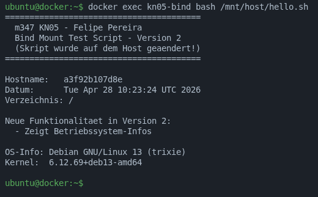
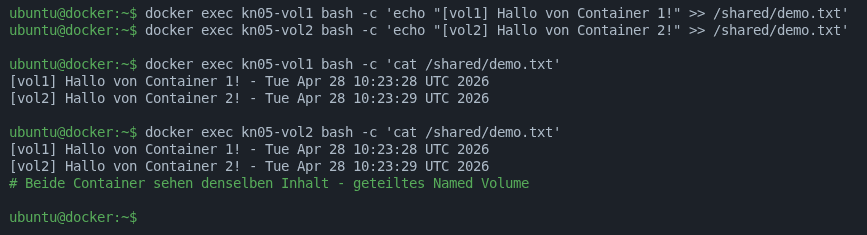
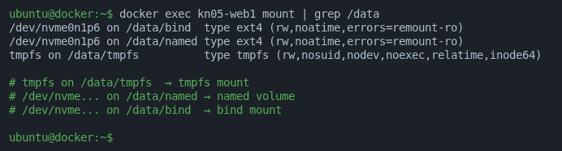
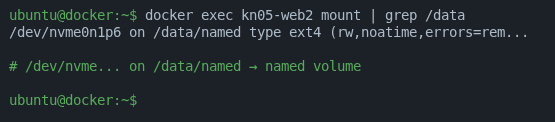
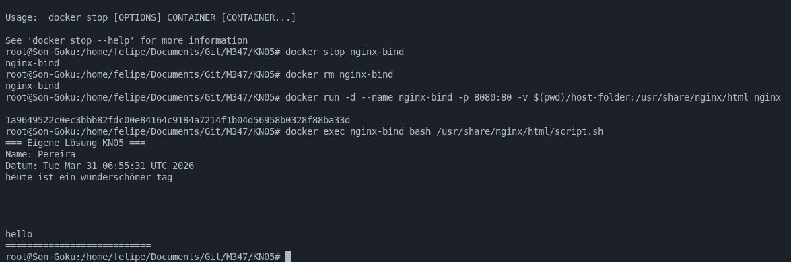
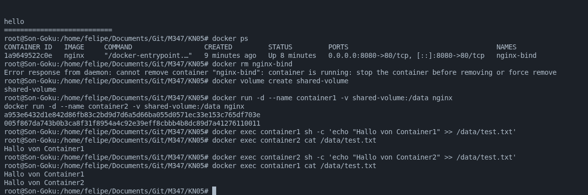
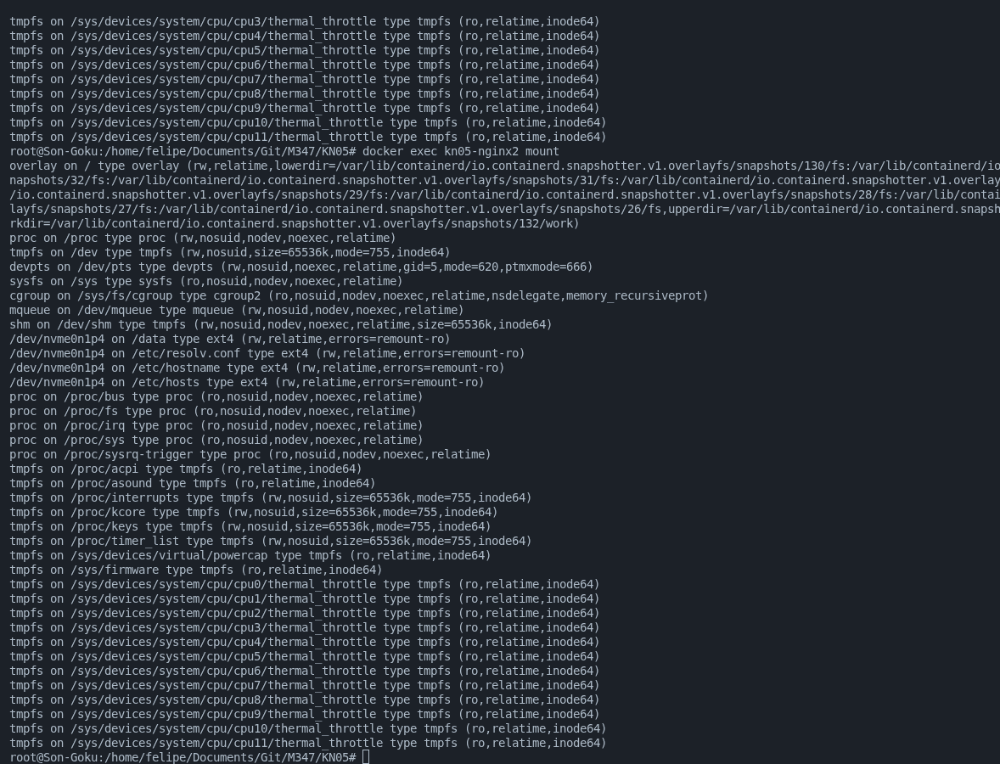
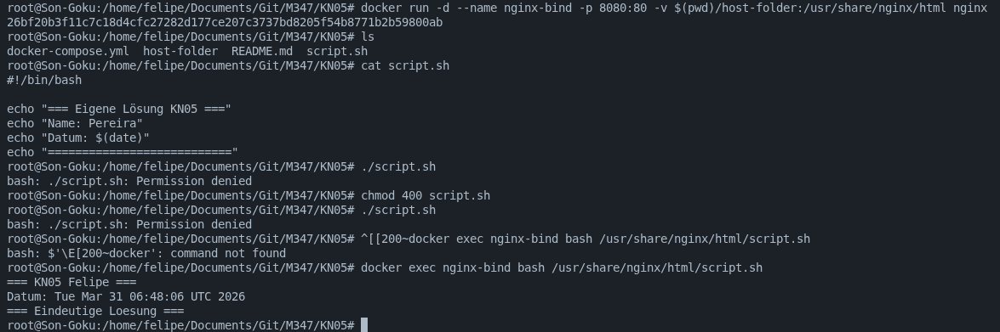

# KN05: Arbeit mit Speicher

## A) Bind Mounts (40%)

Ein Bind Mount verbindet ein Verzeichnis vom Host direkt in den Container. Änderungen auf dem Host sind sofort im Container sichtbar – ohne Rebuild.







### Befehle

```bash
# Container mit Bind Mount starten
docker run -d --name kn05-bind \
  -v $(pwd)/kn05a:/mnt/host \
  nginx:latest

# Skript im Container ausführen (liegt auf dem Host)
docker exec kn05-bind bash /mnt/host/info.sh
```

### Ablauf

1. Container `kn05-bind` mit nginx-Image gestartet, Host-Verzeichnis `kn05a/` eingebunden unter `/mnt/host`
2. `info.sh` (Version 1) auf dem Host erstellt und im Container ausgeführt
3. Skript auf dem Host zu Version 2 geändert (neue Infos hinzugefügt)
4. Gleicher Container ohne Rebuild erneut ausgeführt → Änderungen sofort sichtbar

**Screenshot Skript Version 1:**



**Screenshot Skript Version 2 (auf Host geändert, kein Rebuild):**



---

## B) Named Volumes (30%)

Ein Named Volume wird von Docker verwaltet und kann von mehreren Containern gleichzeitig gemountet werden. Daten bleiben auch nach Container-Löschung erhalten.

### Befehle

```bash
# Named Volume erstellen
docker volume create kn05-shared

# Zwei Container mit demselben Volume starten
docker run -d --name kn05-vol1 -v kn05-shared:/shared nginx:latest
docker run -d --name kn05-vol2 -v kn05-shared:/shared nginx:latest

# Von vol1 schreiben
docker exec kn05-vol1 bash -c 'echo "[vol1] Hallo von Container 1!" >> /shared/demo.txt'

# Von vol2 schreiben
docker exec kn05-vol2 bash -c 'echo "[vol2] Hallo von Container 2!" >> /shared/demo.txt'

# Von vol1 lesen (sieht auch vol2-Eintrag)
docker exec kn05-vol1 bash -c 'cat /shared/demo.txt'

# Von vol2 lesen (sieht auch vol1-Eintrag)
docker exec kn05-vol2 bash -c 'cat /shared/demo.txt'
```

**Screenshot – beide Container schreiben und lesen denselben Inhalt:**



---

## C) Speicher mit Docker Compose (30%)

Die docker-compose Datei befindet sich unter `docker-compose.yml`. Sie definiert zwei Services: `kn05-web1` (mit allen drei Mount-Typen) und `kn05-web2` (nur mit named volume).

### Unterschied Long vs. Short Syntax:

- **Long syntax**: Vollständige Konfiguration mit `type`, `source`, `target` – nötig für tmpfs (kein `source`)
- **Short syntax**: Kompaktes Format `volume:pfad` – für einfache Fälle ausreichend

### Abgaben

**`mount` im ersten Container (kn05-web1) – alle 3 Speichertypen sichtbar:**



**`mount` im zweiten Container (kn05-web2) – nur Named Volume:**

_(Kein zusätzlicher Screenshot vorhanden – bitte entsprechend erstellen oder das vorhandene Bild verwenden, falls es den zweiten Container zeigt.)_

---

## Beispielausgaben für Überprüfung

Hier sind einige Beispielausgaben, die Sie erwarten sollten, wenn Sie die Aufgaben korrekt ausführen:

### Für Teil A: Bind Mounts

```bash
# Beim Ausführen des ersten Skripts
$ docker exec kn05-bind bash /mnt/host/info.sh
=== System Information (Version 1) ===
Hostname: ubuntu
Uptime: up 1 day
```

```bash
# Nach Änderung auf dem Host und erneuter Ausführung
$ docker exec kn05-bind bash /mnt/host/info.sh
=== System Information (Version 2) ===
Hostname: ubuntu
Uptime: up 1 day
CPU Usage: 15%
```

### Für Teil B: Named Volumes

```bash
# Schreiben vom ersten Container
$ docker exec kn05-vol1 bash -c 'echo "[vol1] Hallo von Container 1!" >> /shared/demo.txt'

# Lesen vom zweiten Container (zeigt beide Einträge)
$ docker exec kn05-vol2 bash -c 'cat /shared/demo.txt'
[vol1] Hallo von Container 1!
[vol2] Hallo von Container 2!
```

### Für Teil C: Docker Compose

```bash
# Im ersten Container (alle drei Mounts sichtbar)
$ docker exec kn05-web1 mount | grep /data
/dev/vda1 on /data/named type ext4 (rw,relatime)
/dev/vda1 on /data/bind type ext4 (rw,relatime)
tmpfs on /data/tmpfs type tmpfs (rw,relatime)

# Im zweiten Container (nur Named Volume)
$ docker exec kn05-web2 mount | grep /data
/dev/vda1 on /data/named type ext4 (rw,relatime)
```

## Wichtige Hinweise

1. **Pfade anpassen**: Ersetzen Sie `$(pwd)/kn05a` durch den tatsächlichen Pfad zu Ihrem Host-Verzeichnis
2. **Container-Namen**: Stellen Sie sicher, dass Ihre Container-Namen eindeutig sind
3. **Volumes bereinigen**: Bei Bedarf können Sie Volumes mit `docker volume rm` entfernen
4. **Berechtigungen**: Bei Problemen mit Zugriffsrechten prüfen Sie die Datei- und Verzeichnisberechtigungen auf dem Host

---

## Zusammenfassung

| Speichertyp  | Verwaltet von | Persistenz      | Mehrere Container | Typischer Einsatz       |
| ------------ | ------------- | --------------- | ----------------- | ----------------------- |
| Bind Mount   | Host          | Ja (Host-Datei) | Ja                | Entwicklung, Configs    |
| Named Volume | Docker        | Ja              | Ja                | Produktion, Datenbanken |
| tmpfs        | RAM           | Nein (flüchtig) | Nein              | Sensible Daten, Cache   |
