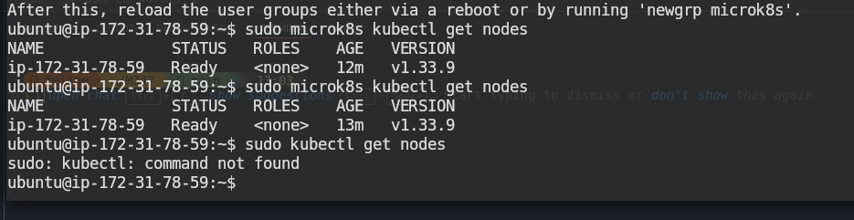
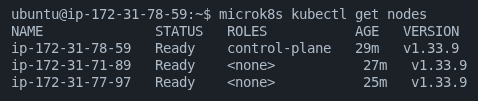
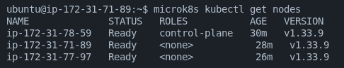
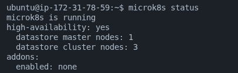
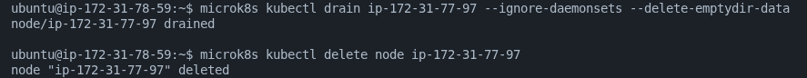
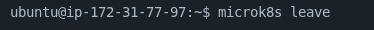

# KN06: Kubernetes I

## Übersicht

| Teil | Aufgabe | Abgabe |
|------|---------|--------|
| A | Installation (MicroK8s Cluster) | Screenshot: `microk8s kubectl get nodes` mit 3 Nodes |
| B | Cluster Verständnis | Screenshots + Erklärungen |

---

## A) Installation (50%)








### 1. AWS EC2 Instanzen erstellen

**3 Instanzen** mit folgenden Settings:
- **AMI:** Ubuntu 22.04 LTS
- **Type:** t3.small (min. 2 CPU)
- **Security GroupInbound Rules:**
  - SSH (22)
  - HTTP (80)
  - HTTPS (443)
  - 10250-10255 (für Kubernetes)

### 2. MicroK8s auf jeder Instanz installieren

```bash
# Update und Snap installieren
sudo apt update && sudo apt install -y snapd
sudo systemctl enable --now snapd.seeded.service
sudo snap install microk8s --classic

# User zur Gruppe hinzufügen
sudo usermod -aG microk8s $USER
newgrp microk8s
```

### 3. Cluster aufbauen

**Auf Node 1 (Master):**
```bash
microk8s add-node
# Ausgabe kopieren - sieht aus wie:
# microk8s join 172.31.16.1:25000/abc123def456...
```

**Auf Node 2:**
```bash
microk8s join <master-ip>:<port>/<token>
```

**Auf Node 3:**
```bash
microk8s join <master-ip>:<port>/<token>
```

### Screenshot Abgabe

```bash
microk8s kubectl get nodes
```
→ Screenshot machen: Alle 3 Nodes sichtbar (Name, STATUS, ROLES, AGE)

---

## B) Verständnis für Cluster (50%)

### Schritt 1: Nodes von verschiedenen Instanzen abfragen

**Auf Node 2:**
```bash
microk8s kubectl get nodes
```
→ Screenshot

### Schritt 2: Cluster Status analysieren

```bash
microk8s status
```

**Erklärung der ersten Zeilen:**
- `microk8s` ist der Admin-Befehl für das gesamte Cluster
- Zeigt welche Addons aktiv sind (dns, storage, etc.)
- High Availability Mode = Cluster läuft

### Schritt 3: Node entfernen

**Auf der Node die entfernt werden soll:**
```bash
microk8s leave
```

**Oder vom Master aus:**
```bash
microk8s remove-node <node-name>
```

→ Screenshot vom Resultat

### Schritt 4: Node als Worker hinzufügen

```bash
# Auf der Node die wieder beitreten soll:
microk8s join <master-ip>:<port>/<token> --worker
```

→ Screenshot

### Schritt 5: Status erneut prüfen

```bash
microk8s status
```

**Erklärung Unterschied:**
- Vorher: Alle Nodes waren Master (HA-Modus)
- Nachher: 1 Master + 2 Worker
- Der `--worker` Flag verhindert, dass die Node zum Master wird

### Schritt 6: Nodes von verschiedenen Seiten abfragen

**Auf Master:**
```bash
microk8s kubectl get nodes
```
→ Screenshot

**Auf Worker:**
```bash
microk8s kubectl get nodes
```
→ Screenshot

**Warum gleich?** → Das Cluster ist zentral verwaltet, alle Nodes sehen dieselbe Konfiguration via Kubernetes API Server.

---

## Unterschied: microk8s vs microk8s kubectl

| Befehl | Was es macht |
|--------|--------------|
| `microk8s` | Cluster-Administration: Status, Nodes verwalten, Addons aktivieren, Cluster verlassen/beitreten |
| `microk8s kubectl` | Kubernetes API: Pods, Deployments, Services erstellen/verwalten (wie `kubectl` aber mit microk8s Präfix) |

**Beispiele:**
```bash
microk8s status                      # Cluster Status
microk8s kubectl get nodes           # Nodes über API
microk8s kubectl get pods            # Pods über API
microk8s enable dns                  # Addon aktivieren
microk8s add-node                    # Node zum Cluster hinzufügen
```

---

## Commands Cheat Sheet

```bash
# Status
microk8s status
microk8s kubectl get nodes
microk8s kubectl get pods -A

# Node hinzufügen (auf Master)
microk8s add-node

# Node beitreten (auf Worker)
microk8s join <master-ip>:<port>/<token> --worker

# Node entfernen (auf der Node selbst)
microk8s leave

# Node entfernen (vom Master)
microk8s remove-node <node-name>

# Logs
journalctl -u snap.microk8s.daemon-kubelet -f
```

---

## Wichtige Hinweise

⚠️ **Dieser Cluster wird in KN07 verwendet!**

- Notiere dir die IP-Adressen der Nodes
- Bewahre die SSH-Keys auf
- Dokumentiere alle Befehle die du verwendest

---

## Abgabe-Checkliste

- [ ] Screenshot: `kubectl get nodes` mit 3 Nodes
- [ ] Screenshot: `kubectl get nodes` auf Node 2
- [ ] Screenshot: `microk8s status` (erste Version - HA)
- [ ] Erklärung: Was bedeutet `microk8s status` Output?
- [ ] Screenshots: Node entfernen + Resultat
- [ ] Screenshot: Node als Worker wieder hinzugefügt
- [ ] Screenshot: `microk8s status` (nachher - 1M + 2W)
- [ ] Erklärung: Unterschied vorher/nachher
- [ ] Screenshot: `kubectl get nodes` auf Master
- [ ] Screenshot: `kubectl get nodes` auf Worker
- [ ] Erklärung: Warum beide das gleiche zeigen
- [ ] Erklärung: microk8s vs microk8s kubectl