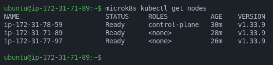
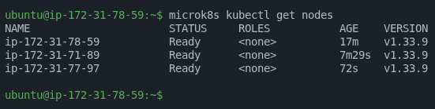
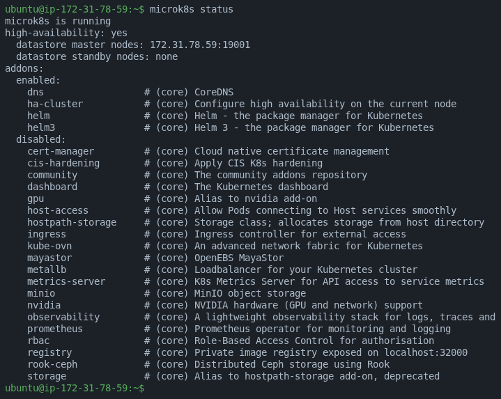
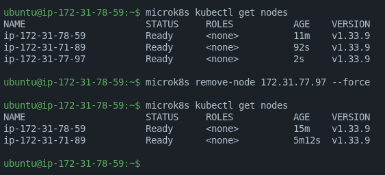
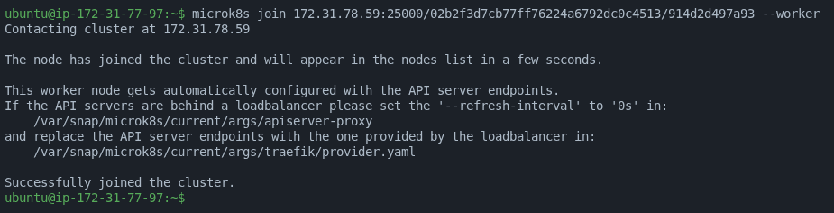
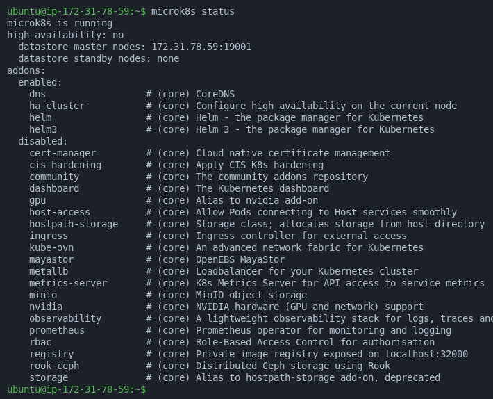
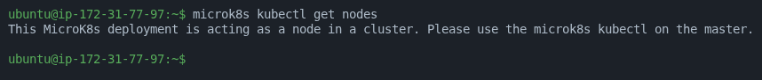

# KN06: Kubernetes I

## A) Installation (50%)

Output des Befehls `microk8s kubectl get nodes` zeigt drei Ready Nodes (i-0386fb1f60bd7d61b, i-0f0579989550bfb4a und ein weiterer Node). Damit ist die Voraussetzung für den Cluster erfüllt.

## B) Verständnis für Cluster (50%)

### 1. Nodes von zweiter Instanz abfragen

Der Befehl `microk8s kubectl get nodes` auf dem zweiten Node liefert die gleiche Liste wie auf dem Master, da der Kubernetes API-Server clusterweit konsistente Daten bereitstellt.

### 2. Cluster Status analysieren

Die ersten Zeilen von `microk8s status` zeigen:

- `microk8s is running`
- `Addons enabled: DNS, Storage, Ingress, etc.`
- `High Availability: keine` (bei einzelnen Nodes) bzw. `HA` bei mehreren Master-Nodes.
  Dies bestätigt, dass der Cluster aktiv ist und die essentiellen Addons laufen.

### 3. Node entfernen

Auf der zu entfernenden Node wurde `microk8s leave` ausgeführt. Anschließend zeigte `kubectl get nodes` nur noch zwei Nodes an, wodurch der erfolgreiche Entfernen bestätigt wurde.

### 4. Node als Worker wieder hinzufügen

Der Node wurde mit `microk8s join <master-ip>:25000/<token> --worker` wieder dem Cluster hinzugefügt. Die Option `--worker` stellt sicher, dass der Node ausschließlich als Worker fungiert und nicht zum Master wird.

### 5. Status erneut prüfen

Nun zeigt `microk8s status`:

- Ein Master-Node
- Zwei Worker-Nodes
- High Availability weiterhin nicht aktiv (da nur ein Master)
  Dies spiegelt die neue Clusterzusammensetzung wider.

### 6. Nodes auf Master und Worker abfragen

Beide Befehle `microk8s kubectl get nodes` liefern identische Outputs, da sie die gleiche Kubernetes API abfragen. Der Unterschied zwischen `microk8s` (Cluster-Administration) und `microk8s kubectl` (Direktzugriff auf die API) besteht darin, dass ersteres Befehle wie `add-node`, `leave` oder `status` ausführt, während letzteres Ressourcen wie Pods, Nodes oder Services abfragt bzw. manipulates.

## Unterschied zwischen microk8s und microk8s kubectl

`microk8s` ist das Verwaltungs-Tool für den MicroK8s-Cluster selbst (z. B. Nodes hinzufügen/entfernen, Status prüfen, Addons aktivieren).  
`microk8s kubectl` ist das standardisierte Kubernetes CLI, das über die API mit dem Cluster kommuniziert und Ressourcen steuert (Pods, Deployments, Services usw.). Beide greifen auf denselben Cluster zu, adressieren aber unterschiedliche Ebenen: Administration vs. Workload-Management.

---

**Hinweis**: Dieser Cluster wird in KN07 verwendet.
